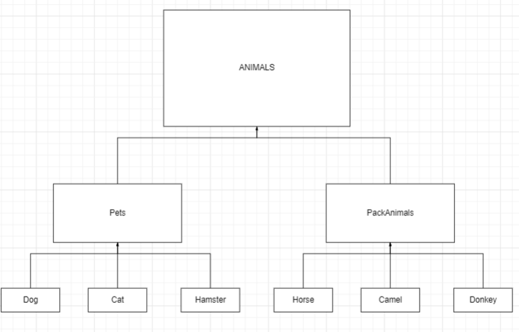

## `Информация о проекте`
Необходимо организовать систему учета для питомника, в котором живут домашние и вьючные животные.

## `Задание:`

### 1. Используя команду cat, в терминале операционной системы Linux создать два файла Домашние животные (заполнив файл собаками, кошками, хомяками) и Вьючные животными (заполнив файл лошадьми, верблюдами и ослами), а затем объединить их. Просмотреть содержимое созданного файла. Переименовать файл, дав ему новое имя (Друзья человека).

 _Прикрепляю скриншоты с командами и их выполнение_

### 2. Создать директорию, переместить файл туда.

 Прикрепляю скриншоты с командами и их выполнение

### 3. Подключить дополнительный репозиторий MySQL. Установить любой пакет из этого репозитория.

Прикрепляю скриншоты с командами и их выполнение

### 4. Установить и удалить deb-пакет с помощью dpkg.

Прикрепляю скриншоты с командами и их выполнение

### 5. Выложить историю команд в терминале ubuntu.

Ниже прикрепляю скриншот истрии команд :

### 6. Нарисовать диаграмму, в которой есть класс родительский класс, домашние животные и вьючные животные, в составы которых в случае домашних животных войдут классы: собаки, кошки, хомяки, а в класс вьючные животные войдут: лошади, верблюды и ослы.

### 7. В подключенном MySQL репозитории создать базу данных “Друзья человека”
### 8. Создать таблицы с иерархией из диаграммы в БД
### 9. Заполнить низкоуровневые таблицы именами(животных), командами которые они выполняют и датами рождения
### 10. Удалив из таблицы верблюдов, т.к. верблюдов решили перевезти в другой питомник на зимовку. Объединить таблицы лошади, и ослы в одну таблицу.
### 11.Создать новую таблицу “молодые животные” в которую попадут все животные старше 1 года, но младше 3 лет и в отдельном столбце с точностью до месяца подсчитать возраст животных в новой таблице
### 12. Объединить все таблицы в одну, при этом сохраняя поля, указывающие на прошлую принадлежность к старым таблицам.